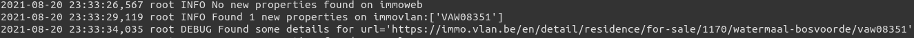
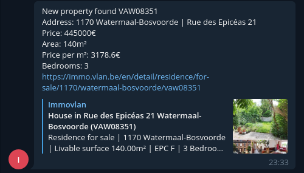

# ImmoBot
Little project made on my spare time motivated by my personnal search for a new immo property.
This is the back-end of a simple telegram bot that monitors multiple immo websites for new properties fitting your (/ my) search criterias and alerts you (/ me) on telegram.

It also computes some simple other metrics not usually available on immo websites (e.g. price/sqm).

This currently looks through these (Belgian) Immo websites:
- Immoweb
- Immovlan
- Realo

However, the main search component could be easily extended to other websites.

# Requirements
To run the various components of the immo search you will need:
- python 3.x
- The following pip packages:
	- selenium
	- pyhocon
	- telegram-send (see [here](https://medium.com/@robertbracco1/how-to-write-a-telegram-bot-to-send-messages-with-python-bcdf45d0a580) for easy configuration tutorial)
	- schedule
- geckodriver (firefox headless)

# What does it do exactly ?
A picture is worth a thousand word - the first picture shows what you can expect to see in your terminal while the bot is running.

While this second picture shows what you'll receive on telegram from the preoperty found by the bot.

# How to setup for yourself
- First if not done already, follow [this tutorial](https://medium.com/@robertbracco1/how-to-write-a-telegram-bot-to-send-messages-with-python-bcdf45d0a580) on setting up your telegram bot
- Once done, make a copy of the 'template.conf' file and add your newly generated API key to it (or not ?)
